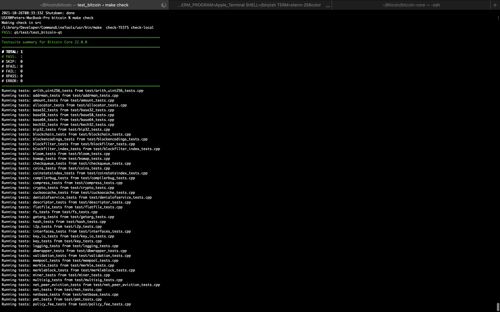
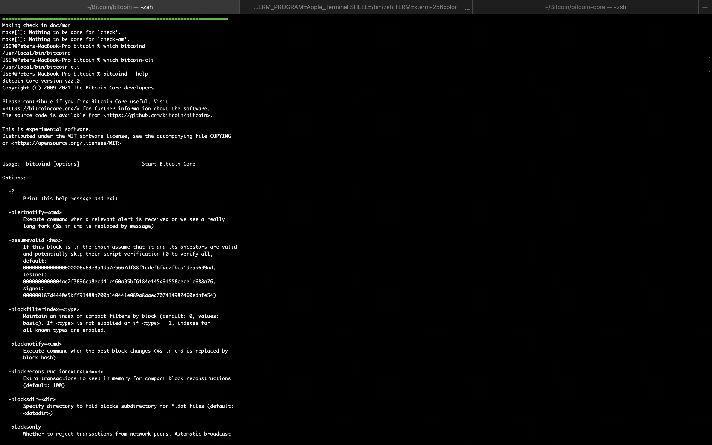

# bitcoin-core

## Definition of Terms

    ### Bitcoin Core: 
        > Bitcoin Core is the reference implementation of the bitcoin system, meaning that it is the authoritative reference on how each part of the technology should be implemented. Bitcoin Core implements all aspects of bitcoin, including wallets, a transaction and block validation engine, and a full network node in the peer-to-peer bitcoin network.

## Objective    
    -   To compile Bitcoin Core and run unit for linked libraries and install Bitcoin Core Daemon (bitcoind) executables.

### STEPS
   -    Step I: Installing libraries:  To be able to build bitcoin command line client called bitcoind, we need to install libraries that will be used to configure Bitcoin Core. Depending on the OS you are using, locate the right instructions specific for your OS from the doc directory [here](https://github.com/bitcoin/bitcoin/tree/master/doc). For macOS, the instructions are in the readme file [here](https://github.com/bitcoin/bitcoin/blob/master/doc/build-osx.md). Follow the instructions and install all the required dependencies.

   -    Step II: Configure Bitcoin Core: Using the `configure script` we can customize the build process to compile the Bitcoin Core source code. Select the option most suitable to you from [here] (https://github.com/bitcoin/bitcoin/blob/master/doc/build-osx.md#building-bitcoin-core) and allow the configure scripts set up the environment for compiling the source code.

   -    Step III: Next, we are ready to compile Bitcoin Core. Using the `make` command, we will compile Bitcoin Core. It is a long process that will take some time to complete if there are no errors.

   -    Step IV: Test - To ensure the linked libraries are not broken, we will run unit tests using the command `make check`. Attached are output.
         
    -   Step V: Installation of bitcoind executables. Using the `make install` command, we will install bitcoind executables on our system. Confirm that Bitcoin Core is correctly installed by running `which bitcoind` which returns the path where bitcoind is installed. You can also check the cli installation path by using `which bitcoin-cli`. Using the help flag, we can get more information on the Bitcoin Core Daemon (bitcoind)
    

    Reference:
    - [1]: https://github.com/bitcoinbook/bitcoinbook/blob/develop/ch03.asciidoc
    - [1]: https://github.com/bitcoin/bitcoin/blob/master/doc/build-osx.md#2-compile